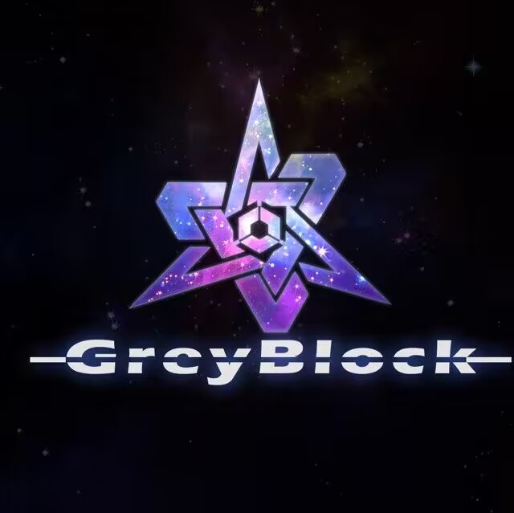
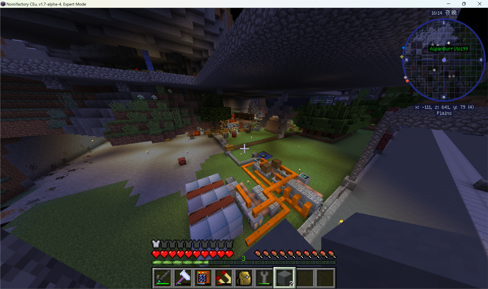
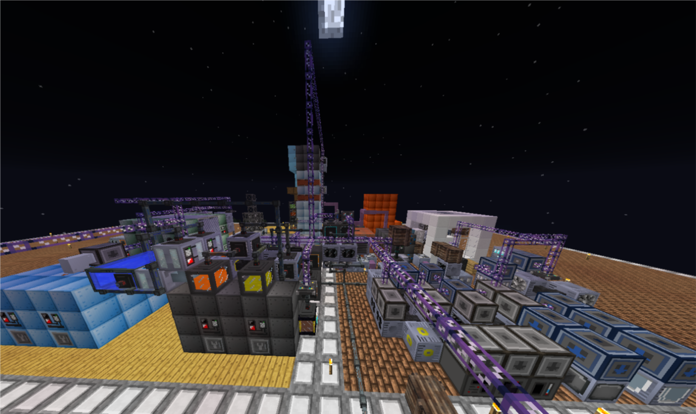
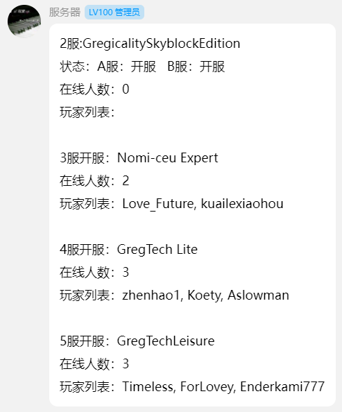

# 梦想嘉年华官网

喜欢各种类型的整合包？对格雷GT情有独钟？来加入我们吧

# 【梦想嘉年华-泛银河系格雷科技无限公司地球分部】

[由于服务器规则限制默认只显示单个服务器在线人数]

DreamCarnival成立于2020.02.01，最初是基于GregBlock空岛及其同类整合包的公益生存服务器，逐渐发展出了众多分部。包括但不限于Nomi，GTlite，Gtlisure等整合包，同时积极尝试过更多更新的整合包。欢迎不仅是热爱GregTech而是所有Minecraft的玩家加入。

   DreamCarnival发展至今下属已经拥有多个子服，正在向发展社区努力。目前由多名热爱游戏且富有经验的玩家共同维护，在积极更新的同时也为各位员工的体验保驾护航，如果你有更好的想法欢迎积极和我们反馈。
   
*非不可抗力因素影响，每个子服务器都会留给格雷员工们足够的时间去充满你们的终极电池或实现终极目标。

  QQ群：917147250 [点击加群](https://qm.qq.com/q/IX4FqNndGa)
  
  很荣幸向您简绍目前公司的分部开设情况。请原谅员工们令人惊(bei)奇(shang)的拍摄技巧。
  
  由于本服自主性极高，您现在看到的服务器List是截止发稿时的所有分部，不代表我们的所有内容。如果您想要了解更多欢迎加入我们。

[分割线]

## 2服：[GSE]Gregicality Skyblock Edition

——

厌倦了GTCE的低难度流程 想要来点更刺激的？

来试试Gregicality吧。

——

GregicalitySkyblockEdition is a skyblock pack based around automation, industrialization and complexity, an Ex Nihilo skyblock based around GregTech. So why should you play it instead of all the other expert packs out there? Well, it's just different. It doesn't have your typical EnderIO, Thermal Expansion, Mystical Agriculture,... heck, it's based around only 20 content mods (it has a lot of small utility mods) and has more play-time than any pack with 100 content mods. The goal of GregicalitySkyblockEdition is to revisit how modded was in simpler times, when everyone could play with mods and where the goal wasn't being overpowered, but mass automation. Thence it requires merely 2GB of RAM and a multi-core CPU to run, meaning most people will be able to play it with ease. It's going to be really time consuming, so if you don't have a lot of time on your hands, this might not be the pack for you. You are going to need to plan how you spend your time, find the most efficient route and decide whether to grind it out or invest into automation. It's only going to be grindy only if you make it grindy. As you progress you'll find new challenges, but what used to be really difficult will be simple and what was once manual will become automated. With that said, why don't you give it a go?

GregicalitySkyblockEdition是一个基于自动化、工业化的复杂整合包，整合包以GregTech为核心。那你为什么要玩它而不是其他的专家包呢？只是不同而已。它没有空岛典型的末影接口、神秘农业。见鬼，它只有20个主要的模组（它有很多小的实用模组）和需要比100模组整合包更长的游玩时间。GregicalitySkyblockEdition的目标是重新审视模组在简单的时代，那时每个人都可以玩mods，目标不是被压倒，而是大众自动化。因此，它只需要2GB的RAM和一个多核CPU就可以运行，这意味着大多数人都可以轻松地使用它。这将是非常耗时的，所以如果你手头没有很多时间，这可能不是你的包。你将需要计划如何花费时间，找到最有效的途径，并决定是把它磨出来还是投资于自动化。只有你把它弄得好笑，它才会好笑。随着你的进步，你会发现新的挑战，但过去真正困难的将是简单的，曾经的手动将成为自动化。你为什么不试试呢？

## 3服：[Nomi-CEu]Nomifactory CEu-Expert

——

给自己上点强度？

——

Nomifactory CEu，亦即Nomifactory (GTCEu Port)，是一个基于格雷科技社区版非官方版（GTCEu）的格雷科技整合包，这是一个任务驱动的科技类整合包。此整合包基于 Nomifactory 1.3版本，将原本基于格雷科技社区版及其附属格雷之影的内容更换为使用GTCEu与其附属后，又基于具体情况做了诸多调整，同时还带来了更多的新任务，进度与许多平衡性调整，从而使整合包适应从GTCE到GTCEu带来的改变。

如您想要一次更难，或者说更“真实”的GregTech体验，请看看专家模式。专家模式基于全能工厂的一个分支，这将使得本整合包变得更加困难，具体的变动如下：
   
强制和平模式，玩家无法手动调整难度；

禁用深度怪物学习，玩家无法通过其来获得无穷无尽的资源了；

本整合包添加的货币（nomicoins）无法使用，亦无法被获取；

蒸汽时代回归；

更多使用GT发电机而不是以蒸汽能源炉或通货能源炉等方式来替代；

禁用创造量子缸，后期使用稳定采掘机（stabilized micro miner）来获取资源；

更复杂的配方，如铱，石墨烯与通货能源炉等。

## 4服：[GTLite]格雷科技精简版 GregTech Lite

——

玩点放松的？

——

格雷科技精简版（GregTech Lite，简称GTLite）是一个基于GTCEu与其附属GCYM的科技类整合包，顾名思义，这是一个强调轻量与精简的格雷科技整合包。

在GTLite中，你将在温馨舒适的环境中游玩格雷科技，并充分体会其的乐趣。与其他同类型整合包不同的是，GTLite并不是以强调格雷科技的难度，亦或者对玩家发起挑战为目的的。

除了GTCEu及其附属以外，还添加了例如应用能源与末影接口这样的模组以对部分内容进行简化，并对其进行平衡性调整。这里只有格雷科技，所以你可以完全安心地去享受这个模组，而不是被魔法亦或者冒险干扰。

## 5服：[GTL]格雷科技休闲版 GregTech Leisure

——

2.0！全新版本开启！

——

GregTech  Leisure，顾名思义，是一个主打休闲的格雷科技整合包，相对于其他格雷包难度更低，但不是咸鱼版。

在这个整合包里，你可以安心的搭建各种资源的产线，无需打怪前期就可以拥有全自动的屠宰场，可以全程和平模式；无需担心挖矿问题，开局可以领取探矿仪金钢杵；无需担心发电问题，从低级到高级拥有一套完整强大的GT发电产线；无需担心资源存储，在进入LV前会送一套AE设备，并且AE不限制频道。

——————————————————END—————————————————

  无论你是格雷发烧佬，热爱Minecraft的玩家，还是想要入坑的小萌新，在梦想嘉年华中都能找到最适合你的位置。我们尽全力为所有Minecraft玩家提供最适合游玩的服务器。欢迎你加入梦想嘉年华，实现自己的格雷梦。

[分割线]

  撰写：ac
  
  维护：DreamCarnival管理组

服务器截图--> 

2024072旧版

## 梦想嘉年华官网

官方QQ群：480170326 [点击加群](https://jq.qq.com/?_wv=1027&k=Fb3J7Pnm)

客户端下载：[百度网盘](https://pan.baidu.com/s/1VGmWN7w-miLFxBcy4fkQQg?pwd=mxjn)

[[多线]梦想嘉年华 —— 格雷空岛GregicalitySkyblockEdition[1.12.2]](https://www.mcbbs.net/thread-951339-1-1.html)

GregicalitySkyblockEdition [原贴](https://www.curseforge.com/minecraft/modpacks/gregicality-skyblock-edition)

#### 本服是公益服并且愿意承担虚假宣传的一切后果

# GregicalitySkyblockEdition
### Description/介绍

This is the official Gregicality Modpack maintained by Irgendwer00.
With only about 130 mods it is a very light modpack.
The main mods are Gregtech and Gregicality, but there are also other mods to help you with automation like AE2, Thermal Dynamics, XNet and some other.
There is a Quest chapter for every Voltage.
You get Money from the Quest.
Crafting components can be bought in the shop.

《我的世界》整合包**Gregicality Skyblock Edition**是一个以Gregicality为展示核心的空岛模式整合包。这个官方整合包由Irgendwer00维护，包含大约130个模组，属于较轻量级的整合包。

主要模组包括**Gregtech**和**Gregicality**，此外还有其他一些模组如**AE2 (应用能源2)**、**Thermal Dynamics (热动力学)**、**XNet**等，以帮助玩家进行自动化。整合包还包括了一系列的技术、任务和硬核模组，为玩家提供了一个更具挑战性的游戏体验。

如果你对GTCE（格雷科技社区版）的低难度流程感到厌倦，想要尝试更刺激的游戏内容，Gregicality Skyblock Edition可能会是一个不错的选择。整合包由Gregicality的原作者decal06制作，并得到了The Galaxit Project的作者brachy84的协助。整合包支持的Minecraft版本为Forge 1.12.2。

每个电压都有一个任务章节。
你从任务中获得金钱。
制作组件可以在商店购买。

### ScreenShot/服务器截图

### Rule & Invitation/规则与邀请
1、如果有合理的意见或建议，欢迎向管理提出，如果建议被采纳，会有适当奖励

2、算一个彩蛋吧 全员飞行 输入/fly即可开启

官方QQ群：480170326 [点击加群](https://jq.qq.com/?_wv=1027&k=Fb3J7Pnm)
客户端下载：[百度网盘](https://pan.baidu.com/s/1VGmWN7w-miLFxBcy4fkQQg?pwd=mxjn)

