## 梦想嘉年华官网
[[多线]梦想嘉年华 —— 格雷空岛GregicalitySkyblockEdition[1.12.2]](https://www.mcbbs.net/thread-951339-1-1.html)

1服 GregBlock [原贴](https://www.curseforge.com/minecraft/modpacks/gregblock)

2服 GregicalitySkyblockEdition [原贴](https://www.curseforge.com/minecraft/modpacks/gregicality-skyblock-edition)

#### 本服是公益服并且愿意承担虚假宣传的一切后果

# 1服GregBlock

### Description/介绍
GregBlock is a skyblock pack based around automation, industrialization and complexity, an Ex Nihilo skyblock based around GregTech. So why should you play it instead of all the other expert packs out there? Well, it's just different. It doesn't have your typical EnderIO, Thermal Expansion, Mystical Agriculture,... heck, it's based around only 20 content mods (it has a lot of small utility mods) and has more play-time than any pack with 100 content mods. The goal of GregBlock is to revisit how modded was in simpler times, when everyone could play with mods and where the goal wasn't being overpowered, but mass automation. Thence it requires merely 2GB of RAM and a multi-core CPU to run, meaning most people will be able to play it with ease. It's going to be really time consuming, so if you don't have a lot of time on your hands, this might not be the pack for you. You are going to need to plan how you spend your time, find the most efficient route and decide whether to grind it out or invest into automation. It's only going to be grindy only if you make it grindy. As you progress you'll find new challenges, but what used to be really difficult will be simple and what was once manual will become automated. With that said, why don't you give it a go?

GregBlock是一个基于自动化、工业化的复杂整合包，整合包以GregTech为核心。那你为什么要玩它而不是其他的专家包呢？只是不同而已。它没有空岛典型的末影接口、神秘农业。见鬼，它只有20个主要的模组（它有很多小的实用模组）和需要比100模组整合包更长的游玩时间。GregBlock的目标是重新审视模组在简单的时代，那时每个人都可以玩mods，目标不是被压倒，而是大众自动化。因此，它只需要2GB的RAM和一个多核CPU就可以运行，这意味着大多数人都可以轻松地使用它。这将是非常耗时的，所以如果你手头没有很多时间，这可能不是你的包。你将需要计划如何花费时间，找到最有效的途径，并决定是把它磨出来还是投资于自动化。只有你把它弄得好笑，它才会好笑。随着你的进步，你会发现新的挑战，但过去真正困难的将是简单的，曾经的手动将成为自动化。你为什么不试试呢？
### ScreenShot/服务器截图
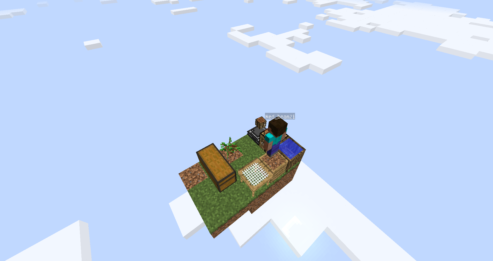

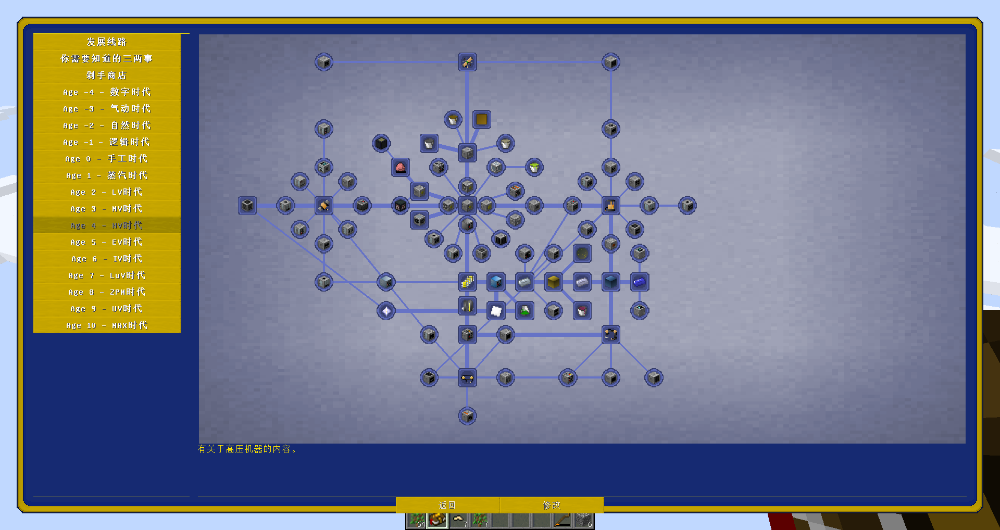

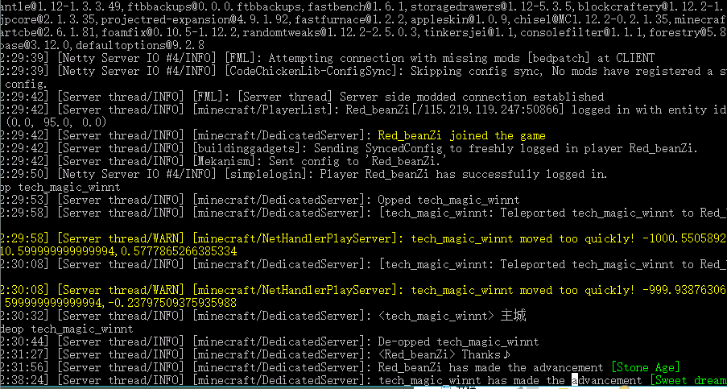
### Rule & Invitation/规则与邀请
1、服务器不存在任何插件，发现bug请向管理提交，发现刷bug第一次没收刷bug所得，第二次直接双ban

2、如果有合理的意见或建议，欢迎向管理提出，如果建议被采纳，会有适当奖励

3、算一个彩蛋吧 全员飞行 输入/fly即可开启

4、最后，梦想嘉年华-GregBlock非常欢迎您的加入！有能力的dalao可以通过无偿赞助来支持服务器，有你们的支持服务器会走的更远

# 2服GregicalitySkyblockEdition
### Description/介绍

This is the official Gregicality Modpack maintained by Irgendwer00.
With only about 130 mods it is a very light modpack.
The main mods are Gregtech and Gregicality, but there are also other mods to help you with automation like AE2, Thermal Dynamics, XNet and some other.
There is a Quest chapter for every Voltage.
You get Money from the Quest.
Crafting components can be bought in the shop.

这是由Irgendwer00维护的官方Gregicality Modpack。
只有大约130个mod，它是一个非常轻巧的mod包。
主要的模组是Gregtech和Gregicality，但也有其他模组可以帮助您实现自动化，如AE2，Thermal Dynamics，XNet等。
每个电压都有一个任务章节。
你从任务中获得金钱。
制作组件可以在商店购买。

### ScreenShot/服务器截图
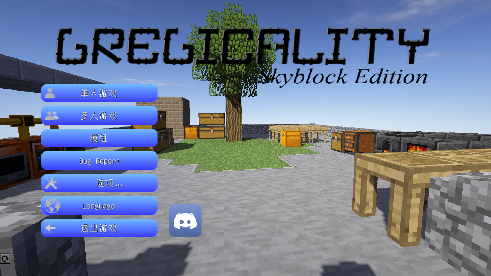
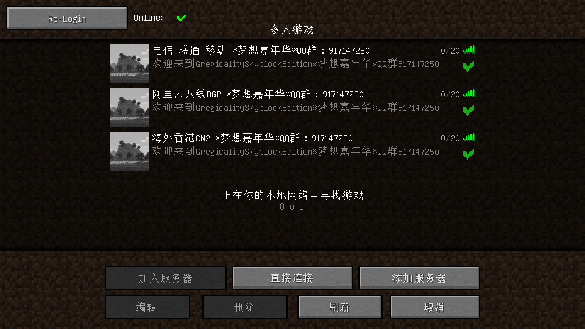
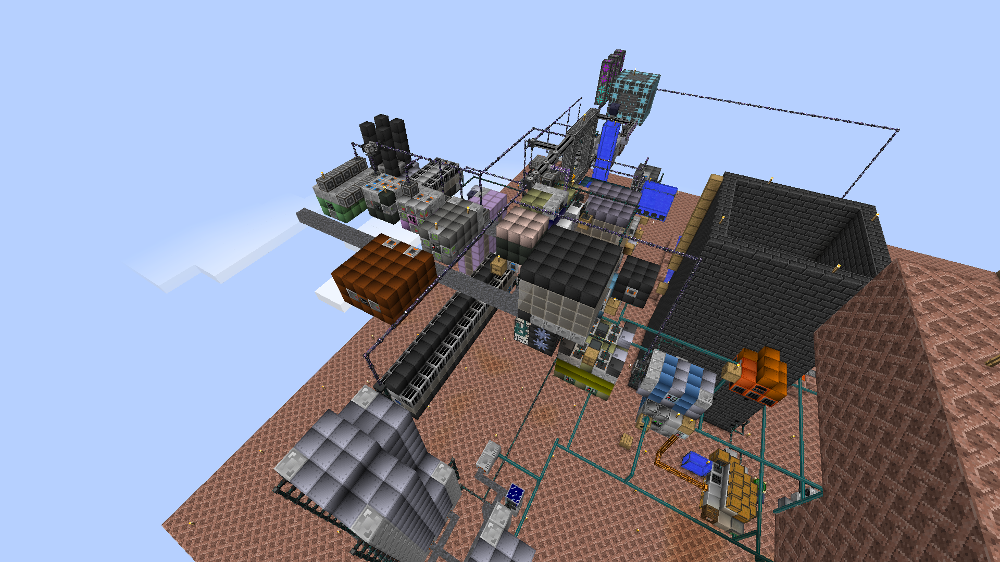
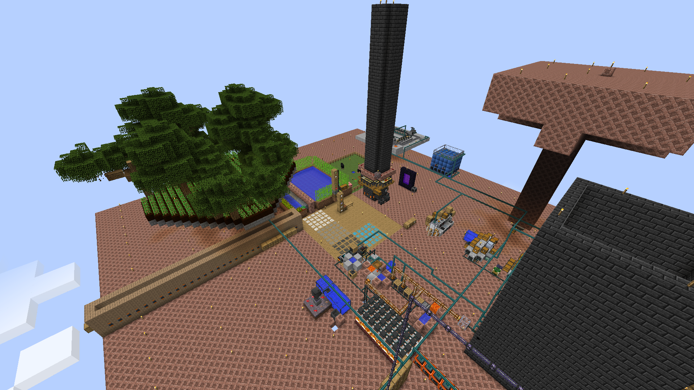
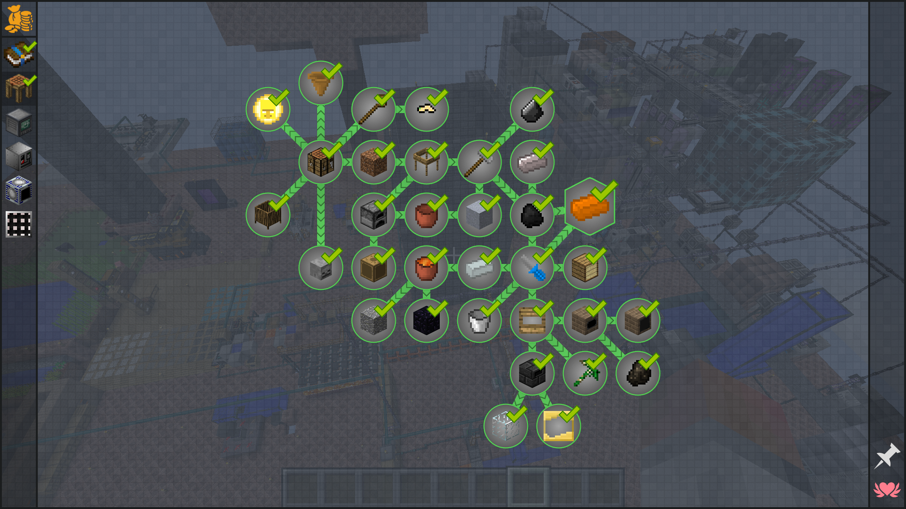
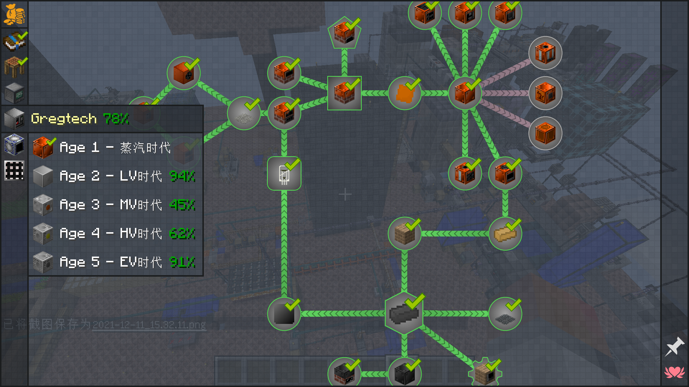
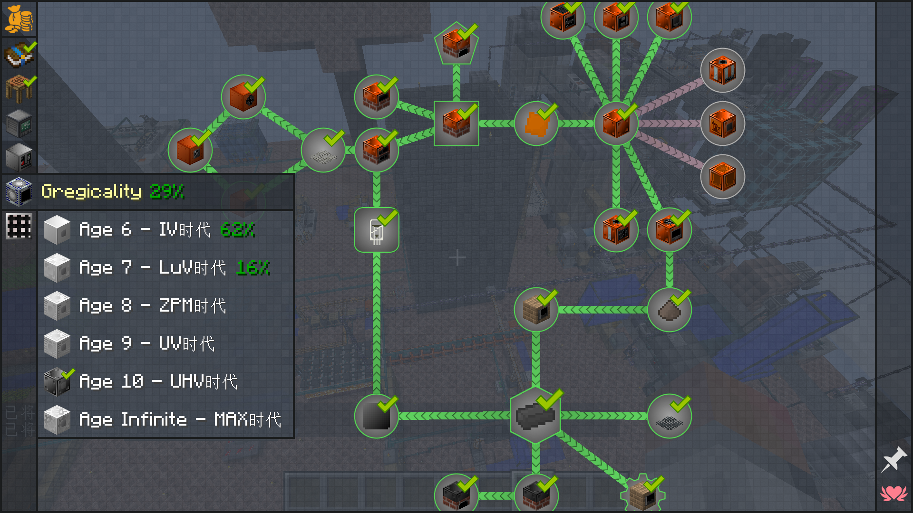
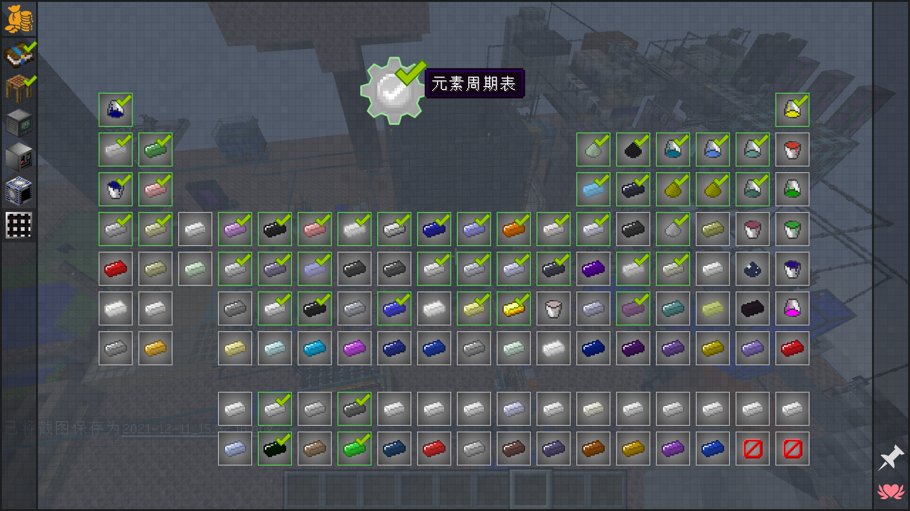

### Rule & Invitation/规则与邀请
1、如果有合理的意见或建议，欢迎向管理提出，如果建议被采纳，会有适当奖励

2、算一个彩蛋吧 全员飞行 输入/fly即可开启

官方QQ群：917147250 [点击加群](https://jq.qq.com/?_wv=1027&k=5LWsVYh)
客户端下载：[微云](https://share.weiyun.com/lgKdkwVv)
